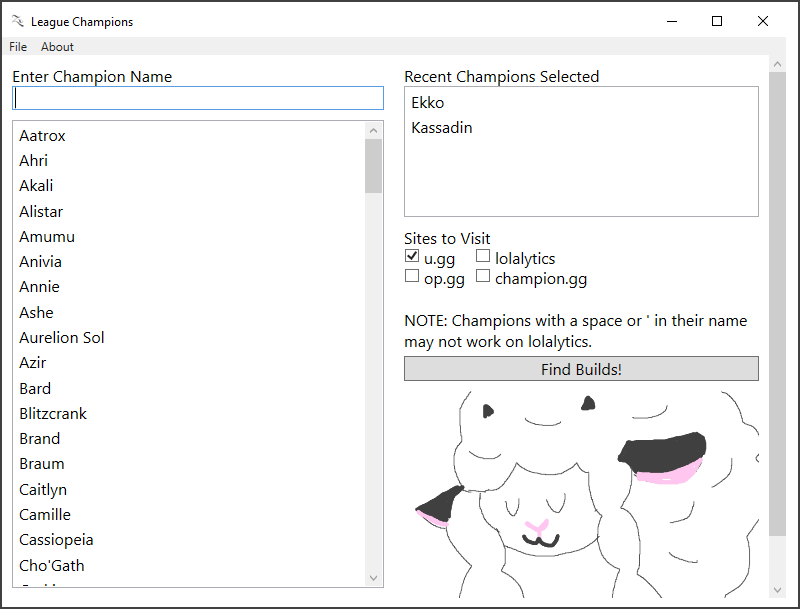

# LeagueGetChampInfo
Get champion information on various third party websites for League of Legends

# Packages Required
1. Visual Studio
2. [NewtonSoft's JSON library](https://www.newtonsoft.com/json)

# Screenshots

# Special Thanks
* [Vincent Tang](https://github.com/vincentpoketang) for pointing out that Dr. Mundo, Vel'Koz, and among other champions with a period, space, or ' in their name did not work for lolalytics.
